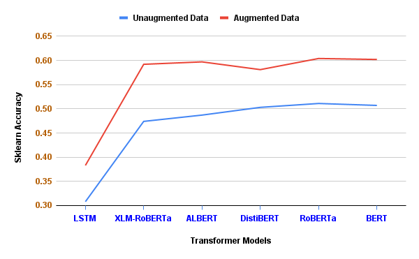
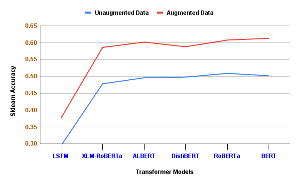
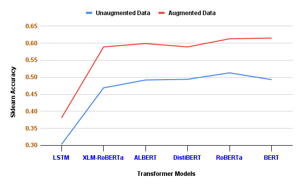
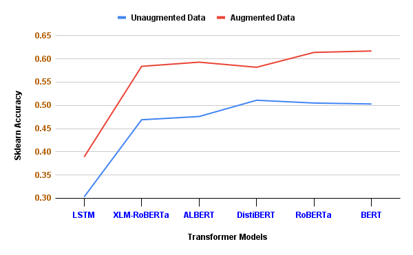

# Data Augmentation for Automated Essay Scoring using Transformer Models
This repository contains the code of the paper "Data Augmentation for Automated Essay Scoring using Transformer Models" by Kshitij Gupta. The paper is available at [IEEE Xplore](https://ieeexplore.ieee.org/document/10085523).

## Introduction
Automated essay scoring (AES), also known as automated essay grading or machine scoring, refers to the use of artificial intelligence and natural language processing techniques to assess and evaluate essays written by humans. This technology aims to streamline the grading process, providing rapid and consistent feedback to students.

## Installation

To use the code and scripts in this repository, please follow these steps:

1. Clone the repository:

   ```bash
   git clone https://github.com/kjgpta/Data-Augmentation-for-Automated-Essay-Scoring-using-Transformer-Models.git
   ```

2. Install the required dependencies. You can use `pip`:

   ```bash
   pip install -r requirements.txt
   ```

3. Setup any additional configuration or environment variables as necessary.

## Usage
This section describes how to use the code and scripts provided in this repository.

1. Firstly, we summarize the topic of each essay using the [BART](https://huggingface.co/docs/transformers/model_doc/bart) model.

2. Next, we normalize the training and validation score out of 10 such that we have 11 bracket of score from 0 to 10.

3. We then added the summary of each topic to the training data and validation data. The data augmentation process is shown below:


4. We trained the model on the augmented data and evaluate the model on the validation data.

5. After thorough analysis, we used the test data and added that data to the training data and trained the model on the augmented data using the updated hyperparameters.

6. We then evaluated the model on the test data.

## Results
The results of the experiments are shown below for all the 4 topics from the test set:

   


## License

This project is licensed under the [CC0-1.0 License](LICENSE).